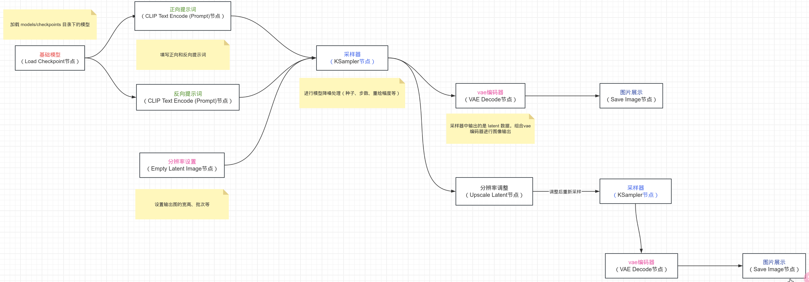
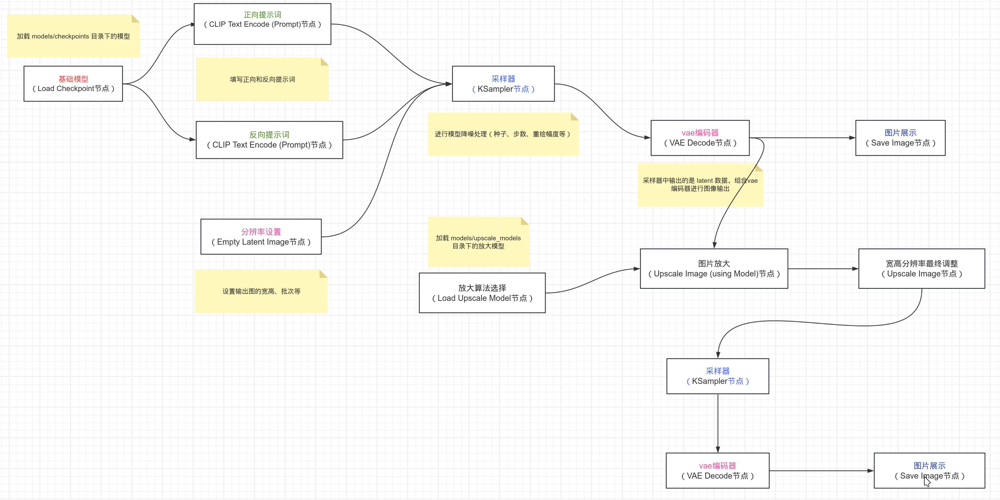
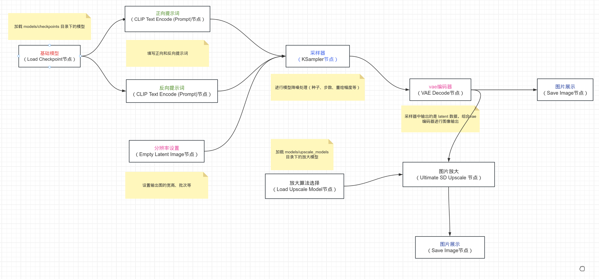
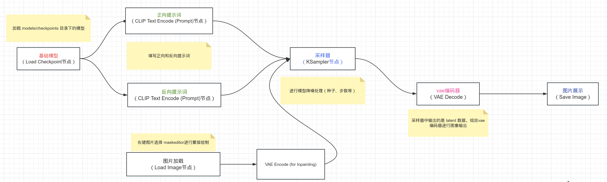
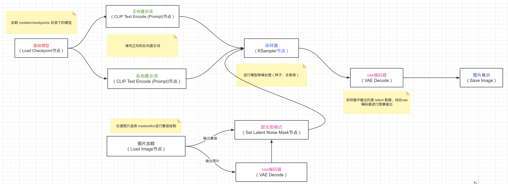

# ComfyUI

https://github.com/comfyanonymous/ComfyUI

## 安装(linux + n卡)

``` shell
pyenv virtualenv 3.10.6 ComfyUI
git clone https://github.com/comfyanonymous/ComfyUI && cd ComfyUI
pyenv local ComfyUI
pip install torch torchvision torchaudio --extra-index-url https://download.pytorch.org/whl/cu124
pip install -r requirements.txt
python main.py
```

## 配置目录说明

- checkpoints目录：models/checkpoints
- vae目录：models/vae

## 自定义节点

- 节点管理：github.com/ltdrdata/ComfyUI-Manager
- 节点流示例：comfyanonymous.github.io/ComfyUI_examples
- 

## 操作

#### 正常文生图流程


### Latent(潜空间)放大

/ComfyUI_examples-master/2_pass_txt2img/hiresfix_latent_workflow.png



### 放大算法(传统模型)放大

- 放大模型：https://openmodeldb.info/

/ComfyUI_examples-master/2_pass_txt2img/hiresfix_esrgan_workflow.png



### sd(分区)放大(推荐)



### 局部重绘(文生图模式)
/ComfyUI_examples-master/inpaint/inpaint_example.png

适合重绘前后变化较大的情况（webui中的空白潜空间重绘）



### 局部重绘(图生图模式)

适合重绘前后变化差异较小的情况（webui中的噪声潜空间重绘）




### controlnet

https://huggingface.co/lllyasviel/ControlNet-v1-1/tree/main
