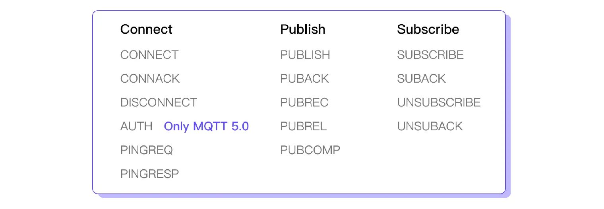

## 一、Broker、调试工具安装

### 1. Broker

> `broker` 这里选择 `emqx`。具体选型参考：[Broker 选型指南](https://www.emqx.com/zh/resources/a-practical-guide-to-mqtt-broker-selection){target=_blank}

``` shell title="docker-compose.yml"
services:
  emqx1:
    image: emqx/emqx:5.8.6
    container_name: my-mqtt
    healthcheck:
      test: ["CMD", "/opt/emqx/bin/emqx", "ctl", "status"]
      interval: 5s
      timeout: 25s
      retries: 5
    ports:
      - 1883:1883
      - 8083:8083
      - 8084:8084
      - 8883:8883
      - 18083:18083
    volumes:
      - emqx1-data:/opt/emqx/data
      - emqx1-log:/opt/emqx/log

volumes:
    emqx1-data:
    emqx1-log:
```

### 2. 调试工具

> `mqtt` 调试工具选择 `mqttx`。或者直接访问：[https://mqttx.app/web-client#/recent_connections](https://mqttx.app/web-client#/recent_connections){target=_blank}

``` shell
docker pull emqx/mqttx-web

docker run -d --name mqttx-web -p 80:80 emqx/mqttx-web
```

## 二、Mqtt报文

参考:[MQTT 5.0 报文（Packets）入门指南](https://www.emqx.com/zh/blog/introduction-to-mqtt-control-packets){target=_blank}

### 1. 报文类型



主要将mqtt的报文分为连接、发布、订阅三个类别，15种报文控制类型。

### 2. 报文格式

mqtt中无论是什么类型的控制报文，它们都由固定报头、可变报头和有效载荷三个部分组成。


