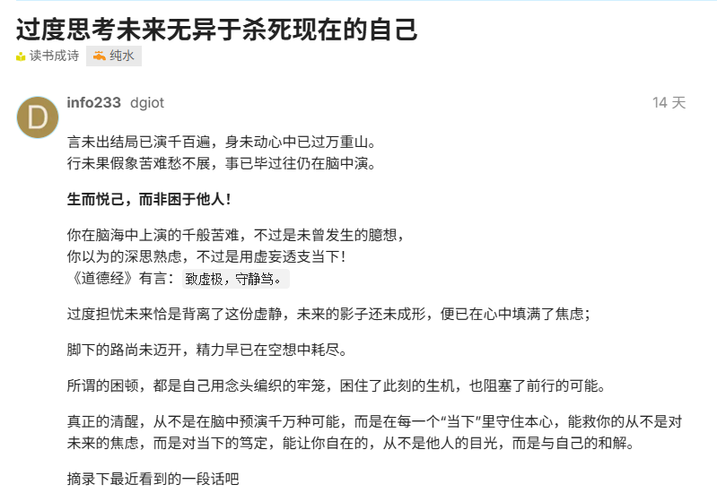

不知觉已经毕业7年了，也30了，确实昂，三十好像是个分水岭，以前没怎么在意的方面最近也都思考了起来。

还是先说下工作方面吧，毕竟事关吃饭的头等大事，说起来也是幸运，这7年间的三份工作都是双休的，可能也跟选的公司规模不大有关吧，去年三月进到公司以来陆陆续续做了几个项目，但都属于初期阶段，没错这公司是24年底创办的，到现在都没什么项目奖金，但基本工资比上家好点，7年的普通程序员工资应该多少呢，可能还是偏低的吧，上上周也就是元旦前，有个同事跟leader吵起来，那小伙子比我还大一岁，上班玩手机被说了下，那脾气那底气，一看就是存款足足的，说公司福利什么的没有，周一到周四还等到8点下班，balabala的，把leader气的大敲桌子。果不其然，元旦过后，老板来了一趟，上周就开人，但好歹也算n+1，现在工作规章也算正式了点，先把任务拆禅道，分配后做完就下班，不用想之前那样到8点，也加绩效审核了。总的来说，算好事，这就是所谓的整顿职场了吧，很高兴能遇到这种事情，但我也确实没这个胆量。能感觉到leader好像还是挺看重我的，但单纯个人感觉，这种事情最终还是看到手的工资吧，做好自己份内的事，以前打工可能还看看职业发展，现在更多的是考虑到手工资，这算是7年牛马对我的改变嘛？？

今年开始引入AI编程工具了，感觉就是把那小伙子炒了的工资拿来买编程套餐，笑死😆。现在开发最大的变量就是AI了，以前还有什么语言之争，前后端之争，AI来了，只有会不会用的区分了吧。这也是好的变化，很多以前觉得高大上的功能也能通过AI窥探下原理，起码也算抹平了相当部分的技术壁垒了，好事，希望自己能用好这个编程工具，保住饭碗🥣。好在第二份工作特意挑了物联网相关的，比一般纯软件的好一点点，起码等接触到一些硬件，现在AI调试硬件的成本还是没人工的低。

既然说到AI了就继续延伸吧，现在纯的技术博客感觉确实没什么必要了，可能一些野路子经验和复杂点的原理可以写写，其他都能AI解决，而且AI的进步好快，现在已经基本可用了，点赞。shafish这个博客还是想继续更新下去，虽然一年没几篇内容憋出来，但好歹也算存在的记录吧，想写点偏图文操作方面也就是技术使用相关的内容，毕竟从0到1才是最难的（今年从Win/Linux换到Mac的最大感想）。总之AI是个好东西，也想在AI的时代留下点存在的时间线。

最后写点生活，打算读点心理、道家方面的内容，这一年觉得自己心理扭曲了，也感觉偏激了，以前也有感觉，只不过今年好像更强烈，确实也不知道下一阶段的人生该怎么安排，可能相亲结婚组个家庭走下去，也可能自己继续走下去，都没想好，有时会想的很乱，跟成长的家庭有关吧，一路长大好像不知道电视剧上正常的家庭品尝起来是什么的味道，感觉现在更多的是内耗，消耗本来就不多的对未来的美好构想。所以，决定了，这方面真真正正交给缘分吧，无论以后什么路都接受了，庸人自扰，我本就是普通人。

